# ISHI会 OPAMP製造記録

## 概要

私、Shuntaro OHNOがISHI会の「[2025年09月イベント：二日でOPAMP回路ハンズオン](https://ishikai.connpass.com/event/363412/)」で作成したオペアンプ（OPAMP）の製造記録です。

設計の目標、設計の流れ・考えていたこと、製造されたOPAMPの計測結果をまとめました。

## 目標

- 初めての半導体製造なので、なんとか動くオペアンプを作りたい
- 指定された面積（600um × 200um）にレイアウトを押し込みたい

## 【2026/05/06】「愛の説教部屋」でご指導いただきたいこと

[2026年5月イベント「ISHI会三周年記念イベント～学生＆新人、半導体初心者に贈る！～」東京会場](https://ishikai.connpass.com/event/381973/)の「愛の説教部屋」にて、広島大学の久保木先生にお伺いしたいことをまとめました。

設計時に私が考えていたことや、製造されたOPAMPの計測記録はこの後にまとめています。
素人が付け焼刃で作った記録をご覧に入れるのは大変心苦しいのですが、どうぞ厳しいコメントをいただけますと幸いです。

- 「設計の流れ・考えていたこと」で、根本的に誤解していることや、もっと時間をかけて検証すべきだったことはありますか？とくに、以下の点が気になっています。
    - バイアス電流・バイアス電位の正しい決め方が知りたいです。設計時はその重要性を軽視していて、適当に決めたり、シミュレーションサンプルのデフォルト値をとりあえず使ったりしてしまいました。また、製造されたOPAMPの計測結果からは、バイアス電流が不足していたのではないかと疑っています。
    - 各MOSのオーバードライブ電圧は、明確に決めておいた方が良いのでしょうか？もしかして、オーバードライブ電圧を全MOSで統一しておいた方が良い、ということもあるのでしょうか？その場合、Vgsは低消費電力を狙ってVth+0.1V=0.9V程度にするのが良いのか、差動増幅段の出力である1.5V程度に余裕を持たせる方が良いのか、知りたいです。
- レイアウトをさらに改善する方法が知りたいです。とくに、以下の点が気になっています。
    - とても長い配線ができてしまいましたが、これはやはり問題ですか？このような長い配線を作らないためには、どのような工夫がありますか？
    - ガードリングを付けた方がいいと聞いたので、とりあえずたくさん囲ってみましたが、やりすぎでしょうか？囲うべきところ、囲うべきでないところを知りたいです。
    - 今回は、レイアウトテクニックとして「ガードリング」、「コモンセントロイド」、「ダブルビア（打ち方が正しいか自信がないので、コメントをいただけますと幸いです）」のみ実践しました。他のテクニックも含めて、それぞれの効果から比較した、採用すべき優先順位を知りたいです。
- 次は、高周波信号に対応したOPAMPを作ってみたいです。Lを小さくする必要があると思いますが、その際の設計で注意すべきことは何ですか？また、1umプロセスだと、どのくらいの周波数にまで対応できるでしょうか？

## 設計の流れ・考えていたこと

[ハンズオン資料](https://github.com/ishi-kai/openmpw-transistor-level-examples/blob/main/TR10/docs/OPAMP_TR10.pdf)の流れに沿って、以下のように考えながら設計しました。

### MOSFETの基本設計

#### シミュレーション

- nfet_idvgs.sch
- nfet_idvds.sch
- pfet_idvgs.sch
- pfet_idvds.sch

#### 設計方針

短チャネル長変調効果によって動作が不安定になると困るので、Lは最小の1umではなく3umにしました。

W=30um, L=3umで測定した各MOSFETのパラメータは以下のとおりです。

|W=30um, L=3um|pMOS|nMOS|
|:--:|---:|---:|
|Vth|727mV|794mV|
|Id|3.56uA|6.76uA|
|gm|31.6uS|79.4uS|
|rds = 1/gds|17.9MΩ|38.2MΩ|
|gm × rds (intrinsic gain)|565|3030|
|Gain|55.0dB|69.6dB|

「Wが同じ場合、nMOSにはpMOSの倍のIdが流れるんだな～」程度の解像度で考えていました。

以降はL=3umに固定し、Wは30umの倍数で設定することにしました。

### OPAMPの全体像

最終的なOPAMPとして、以下の回路を作ります。

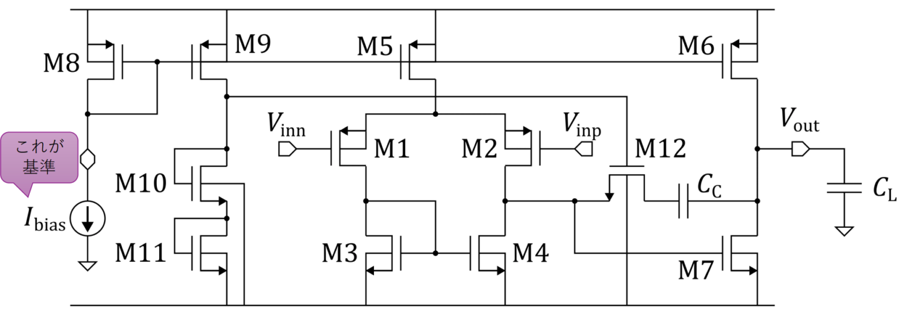

以降は各MOSのWを設定します。

### カレントミラー（Ibiasの設定）

#### シミュレーション

- ibias_rds.sch

#### 設計方針

M8をとりあえずW=90umとすると、Vgs=0.9V、Vds=2.5Vの条件下で**Id=11.8uA**となりました。
これをバイアス電流（Ibias）として、外部電流源から「引き抜く」ことにします。

### ソース接地増幅回路

#### シミュレーション

- cs.sch
- cs.sym
- cs_tran.sch

#### 設計方針

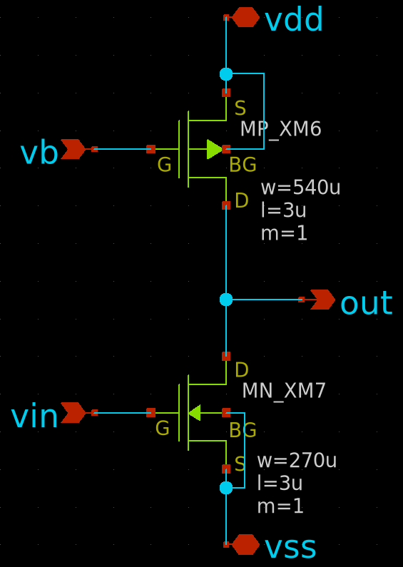

Vout=Vdd/2となるように、pMOS/nMOSのIdの比に基づいてサイズを調整しました。
「MOSFETの基本設計」で計測した結果、以下のとおり、pMOS/nMOSのIdの比が約1:2だったので、Wの比は2:1になるようにしました。

|W=30um, L=3um|pMOS|nMOS|
|:--:|---:|---:|
|Vth|727mV|794mV|
|Id|3.56uA|6.76uA|
|gm|31.6uS|79.4uS|

そのうえで、「十分なスルーレートが得られるよう
に大きな電流を流すこと」というハンズオン資料の指示に従い、pMOSはW=540um, nMOSは270umと大きめにしてみました。

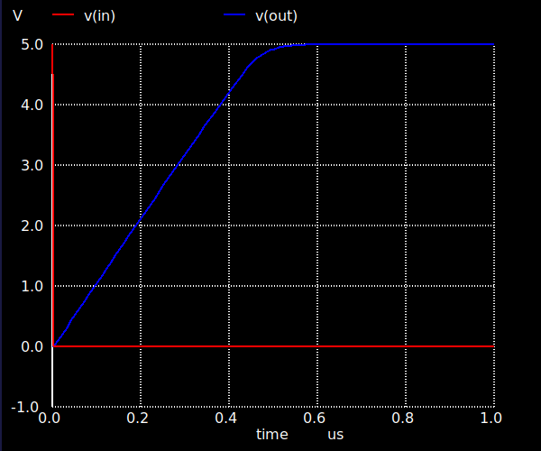

スルーレートを計測したところ、0V→5Vの立ち上がりにかかる時間が0.5us（2MHz）だったので、十分だと判断しました。

（ただし、ハンズオン資料では「Vb=5.0-(Vth+Vod) ～ 3.0あたりにすること」と指示されている`cs_tran.sch`のVbの設定はよくわからなかったので、シミュレーションサンプルと同じVb=3.5Vでスルーレートを計測しました。もしかして、バイアス電流を受けるM8のシミュレーションに合わせて、5.0-0.9=4.1Vにするべきだったかも…？以降のシミュレーションもVb=3.5Vで固定していますが、ちゃんと考慮する必要があったのかもしれません）

### 差動増幅回路

#### シミュレーション

- diff.sch
- diff.sym
- diff_ac.sch
- diff_dc.sch
- 2stage_ac.sch

#### 設計方針

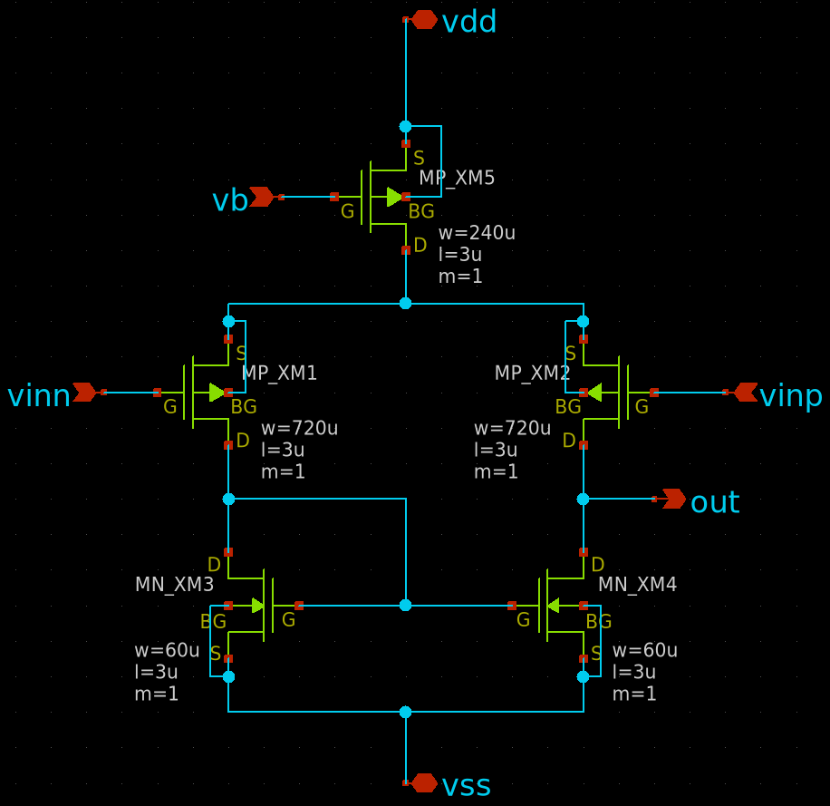

ハンズオン資料から、各MOSのWの設定について、今回の場合以下の条件があることを把握しました。

- M3, M4は小さくていいが、M3=M4
- M5 : M3+M4 = 2 : 1
- M1, M2は大きくして、M1=M2

レイアウト面積が許す限り大きくした方がいいような気がしたので、以下のように設定しました。

|MOS|MOSのタイプ|Wのサイズ|
|:--:|:--:|---:|
|M1, M2|pMOS|720um|
|M3, M4|nMOS|240um|
|M5|pMOS|60um|

AC解析（`diff_ac.sch`）を実施して、M4のVdsが1.36Vになりました。
ここがハンズオン資料（1.47V）と比較して低いので、2段目（ソース接地増幅回路）との兼ね合いが悪くなっているような気がしています。
実際、差動増幅回路の周波数特性は以下のように良い感じになったのですが、2段目と組み合わせると平坦部がほとんどなくなってしまいました（`2stage_ac.sch`）。

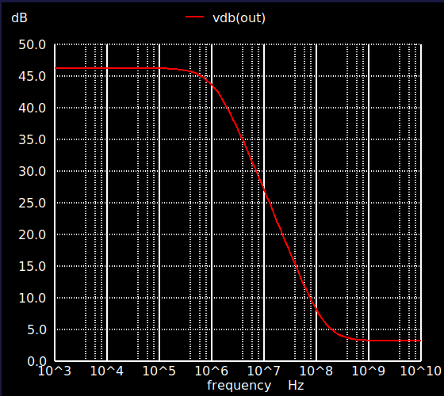

DC解析（`diff_dc.sch`）を実施すると、出力電圧の上限が3.5Vであることがわかりました。
Rail-to-Railにするためのレイアウト面積はなさそうなので、今回はこれで妥協しました。
（同様に、今回はプッシュプル出力段も省略しました）

### 位相補償とOPAMP

#### シミュレーション

- opamp.sch
- opamp.sym
- opamp_ac.sch

#### 設計方針

「なんとか動くオペアンプを作りたい」が目標なので、位相補償用のコンデンサは最大の容量である8.856pFに設定しました。

バイアスレプリカを形成するM9, M10, M11のWの条件について、ハンズオン資料から以下のように読み取りました。

- M6 : M9 = M7 : M11、つまり、M9 = 2 × M11
- M10 = M11

あまり大きさは必要ない気がしたので、M9はW=120um、M10とM11はW=60umにしました。
また、M12はとりあえず最小サイズのW=30umにしました。

AC解析（`opamp_ac.sch`）を実行した結果、周波数特性の平坦部はほとんどなくなってしまいました。

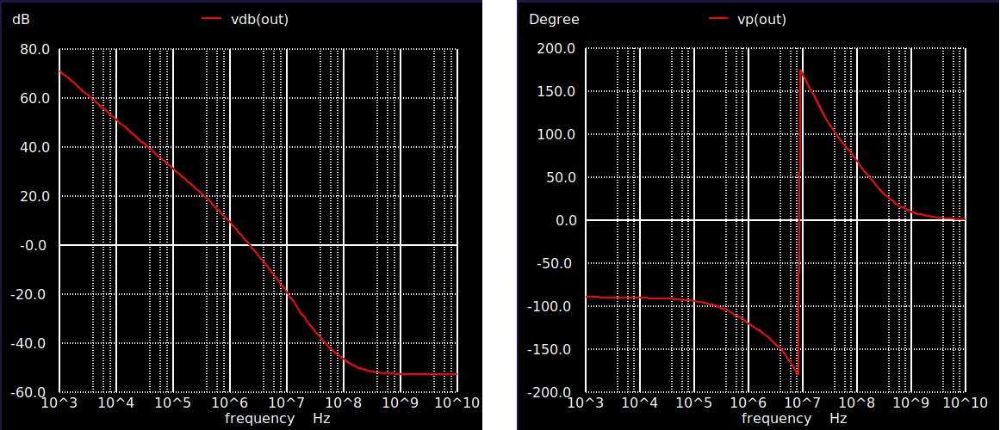

設計時は位相補償の影響かな…と考えていましたが、後から考えると2段目との兼ね合いの影響も？という気がしています。
平坦部はないものの、100kHzでも一応ゲインがあるのでOKということにしました。
また、シミュレーションの結果的には、M12が飽和領域で動いていないような気もするけど…、とりあえず動いてそうなのでヨシ！

### レイアウト

#### GDS

- opamp.gds

#### 設計方針

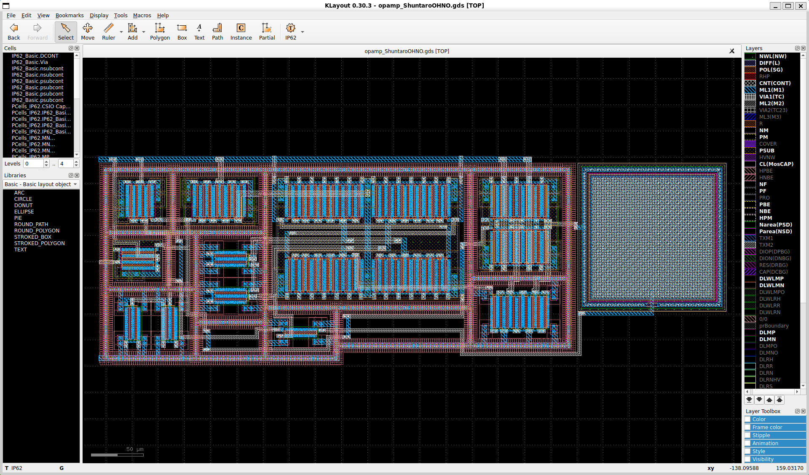

わりと好き勝手に設計をしたあと、600um × 200umのレイアウト面積はかなりギリギリということに気付いたので、とにかく領域内に押し込むことに専念しました。

その際、囲えそうなところはガードリングで囲ってみましたが、囲うべきところとそうでないところの区別は曖昧です。

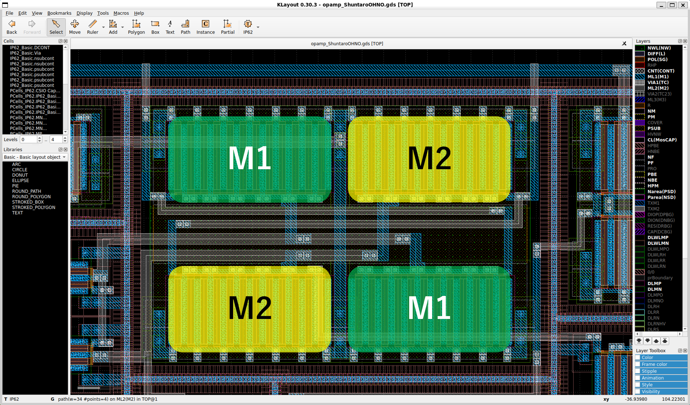

さらに、M1とM2にコモンセントロイドを適用しました。
ビアはとりあえずダブルにした方がいいと聞いたので2つ並べてみましたが、効果的な打ち方になっているかは自信がないです。

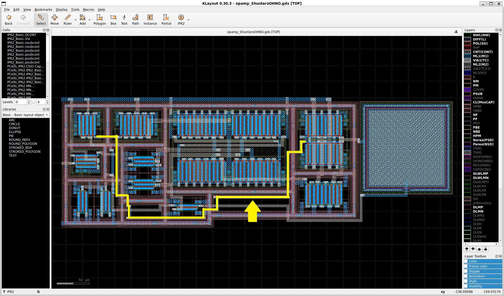

レイアウトを領域内に押し込むことには成功しましたが、その結果、非常に長い配線ができてしまいました（黄色）。
なんとなく、あまり良くないような気がします。

## 製造されたOPAMPの測定

製造されたOPAMPを計測しました。
その際、設定したバイアス電流の11.8uAを引き抜く電流源を使用しました。

### 電圧フォロワ

#### 出力電圧

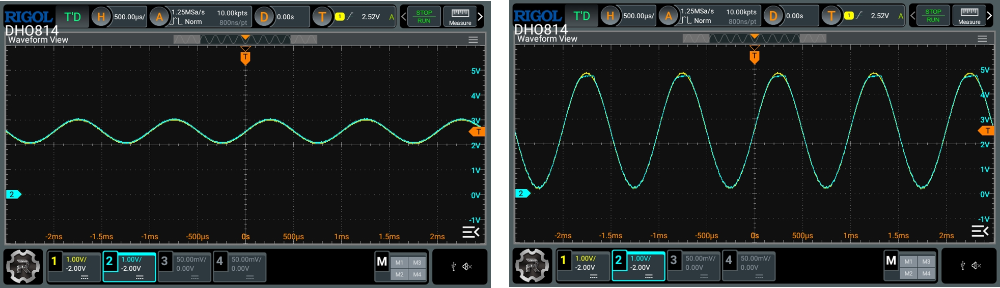

製造したOPAMPで電圧フォロワを組み、1kHzの正弦波を入力しました。
正弦波の振幅を上げていくと、上の電圧が4.6V程度に達したところで歪みました。
下側はまだ余裕がありそうです。

#### 周波数応答

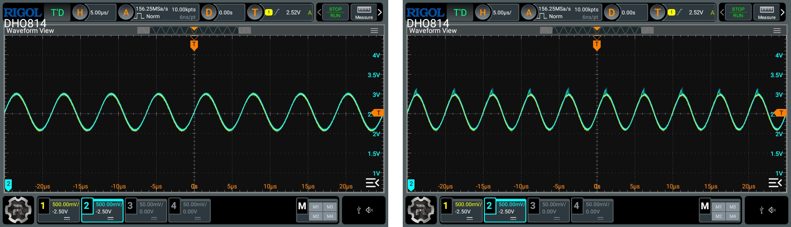

振幅を1Vp-pに固定し、正弦波の周波数を上げていきました。
160kHz程度までは大丈夫そうでしたが、200kHzでは波形が崩れました。

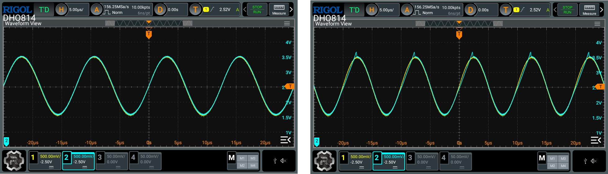

振幅を2Vp-pに固定した場合は、100kHzで波形が崩れました。
80kHz程度までが適正範囲のようです。

### 反転増幅回路

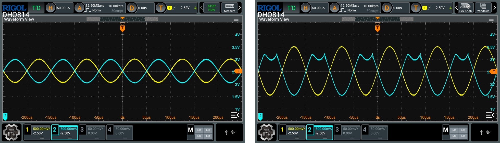

次に、OPAMPで1倍の反転増幅回路を組みました。
10kHzの正弦波を1Vp-pで入力した場合は正常に動作しましたが、振幅を2Vp-pにすると、出力波形（水色）の上端で「鏡像」のような反転が見られました。

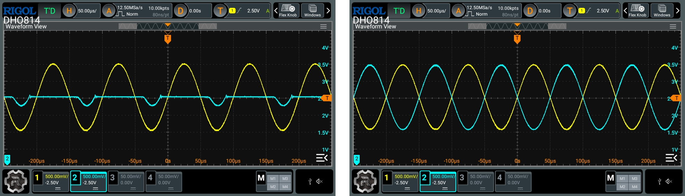

原因を探るため、OPAMPの反転入力端子の電位を計測した結果が上図の左です。
（基準電位2.5Vを受ける非反転入力端子とイマジナリーショートを形成するため、）反転入力端子の電位は一定に保たれるはずですが、入力信号（黄色）に対し、「鏡像反転」が生じたタイミングで電位が落ち込んでいます。

動作電流（バイアス電流Ib）の不足が原因かもしれないと思ってIbを増やしてみたところ、2Vp-pでも正常に動作しました。
バイアス電流は1回のシミュレーションで適当に決めたので、もっと時間をかけて考えるべきだったと反省しています。